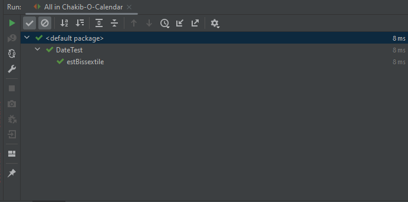
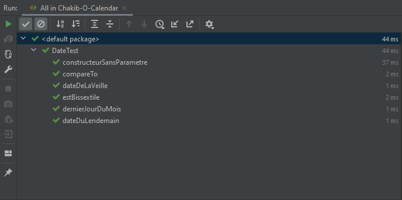
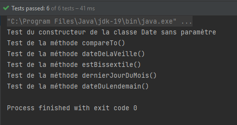

# TD 5 -  Tests et gestion de version pour le développement Java


Je crée un dépôt *github* que j'appelle `Chakib-O-Calendar`.
```bash
git clone git@github.com:444chak/calendar.git
```

___

Pour concevoir les tests de la méthode `DernierJourDuMois()` de la classe `Date` il serait logique de d'abord tester la méthode `estBissextile()` de la même classe. En effet, le dernier jour d'un mois diffère si une année est bissextile ou non.

Ci-dessous, la partition d'équivalence concernant les tests de la méthode `estBissextile(int année)`. 


| année                                  | Sortie |
| -------------------------------------- | ------ |
| année % 4 = 0 **ET** année % 100 ≠ 0   | True   |
| année % 100 = 0 **ET** année % 400 ≠ 0 | False  |
| année % 400 = 0                        | True   |
| année % 4 ≠ 0                          | False  |

| année | Sortie |
| ----- | ------ |
| 2020  | True   |
| 1900  | False  |
| 2400  | True   |
| 2021  | False  |


Une fois la partition d'équivalence *(concernant la méthode qui vérifie si une année est bissextile ou non)* réalisée, la conception de la partition d'équivalence pour la méthode `dernierJourDuMois()` se veut plus accessible.

Ci-dessous, la partition d'équivalence concernant les tests de la méthode `dernierJourDuMois(int mois, int annee)`. 

| mois                     | année                   | Sortie |
| ------------------------ | ----------------------- | ------ |
| mois ∈ {1,3,5,7,8,10,12} | peu importe             | 31     |
| mois ∈ {4,6,9,11}        | peu importe             | 30     |
| mois = 2                 | `estBissextile(année)`  | 29     |
| mois = 2                 | `!estBissextile(année)` | 28     |

| mois | année | Sortie |
| ---- | ----- | ------ |
| 3    | 2014  | 31     |
| 4    | 1972  | 30     |
| 2    | 2020  | 29     |
| 2    | 2021  | 28     |


___ 

Une fois cela effectué, je crée un projet IntelliJ auquel j'ajoute les classes effectuées préalablement en TP de Java. Cela constituera le commit initial de mon dépôt.

```bash	
git add .
git commit -m "Initial commit" 
git push
```

## Tests unitaires
Pour réaliser les tests unitaires de la classe Date, je crée un fichier dans le dossier `src/test/java` du projet IntelliJ. Ce fichier s'appelle `DateTest.java`. 

Pour développer les tests de la méthode `dernierJourDuMois()`, il est nécessaire de préalabelment tester la méthode `estBissextile()`, comme expliqué précédemment.


*DateTest.java*
```java
public class DateTest {

    @Test
    @DisplayName("Test de la méthode estBissextile()")
    public void estBissextile()
    {
        // Selon la partition d'équivalence, il y a quatre cas à tester
        assertAll(
                () -> assertTrue(Date.estBissextile(2020)),
                () -> assertFalse(Date.estBissextile(1900)),
                () -> assertTrue(Date.estBissextile(2400)),
                () -> assertFalse(Date.estBissextile(2021))
        );
    }

}
```

*IntelliJ* affiche le résultat des tests unitaires.


*Commit* des tests unitaires de la méthode `estBissextile()`.
```bash	
git add .
git commit -m "create test JUnit file, add test of Date.estBissextile() with 4 asserts, OK"
```

Désormais, je peux tester la méthode `dernierJourDuMois()`.

*DateTest.java*
```java
@Test
@DisplayName("Test de la méthode dernierJourDuMois()")
public void dernierJourDuMois() {
    assertAll(
            () -> assertEquals(31, Date.dernierJourDuMois(3, 2014)),
            () -> assertEquals(30, Date.dernierJourDuMois(4, 1972)),
            () -> assertEquals(29, Date.dernierJourDuMois(2, 2020)),
            () -> assertEquals(28, Date.dernierJourDuMois(2, 2021))
    );

}
```

*commit* des tests unitaires de la méthode `dernierJourDuMois()`.
```bash
 git commit -m "add unit test of Date.dernierJourDuMois with 4 asserts, OK"
```

Ensuite, pour effectuer les tests des méthodes `dateDuLendemain()` et `dateDeLaVeille()`, il faut avoir testé la méthode `dernierJourDuMois()`, ce qui a été fait précédemment.

Ainsi, voici les partitions d'équivalence concernant les tests de ces deux méthodes.
___


*`dateDuLendemain()`*
| jour                                    | mois        | annee       | sortie                    |
|-----------------------------------------|-------------|-------------|---------------------------|
| jour ≠ `dernierJourDuMois(mois, annee)` | peu importe | peu importe | Date(jour+1, mois, annee) |
| jour = `dernierJourDuMois(mois, annee)` | mois ≠ 12   | peu importe | Date(1, mois+1, annee)    |
| jour = `dernierJourDuMois(mois, annee)` | mois = 12   | peu importe | Date(1, 1, annee+1)       |

| jour | mois | annee | sortie            |
|------|------|-------|-------------------|
| 14   | 7    | 2004  | Date(15, 7, 2004) |
| 31   | 3    | 2012  | Date(1, 4, 2012)  |
| 31   | 12   | 1965  | Date(1, 1, 1966)  |

___

*`dateDeLaVeille()`*
| jour     | mois        | annee       | sortie                                                  |
|----------|-------------|-------------|---------------------------------------------------------|
| jour ≠ 1 | peu importe | peu importe | Date(jour-1, mois, annee)                               |
| jour = 1 | mois ≠ 1    | peu importe | Date(`dernierJourDuMois(mois-1, annee)`, mois-1, annee) |
| jour = 1 | mois = 1    | peu importe | Date(31, 12, annee - 1)                                 |

| jour | mois | annee | sortie            |
|------|------|-------|-------------------|
| 14   | 7    | 2004  | Date(13, 7, 2004) |
| 1    | 4    | 2012  | Date(31, 3, 2012) |
| 1    | 1    | 1965  | Date(31, 12, 1964)|

___

Ensuite, voici la partition d'équivalence concernant les tests de la méthode `compareTo()`.

Les tests de cette méthode sont effectués en comparant deux dates, `dateX` et `dateY`. Les tests sont effectués en fonction de la valeur de `dateX.compareTo(dateY)`.

Les champs de `dateX` sont nommés `jourX`, `moisX` et `anneeX` et ne changent pas la partition d'équivalence peu importe leur valeur.

Les valeurs `jourY`, `moisY` et `anneeY` sont les champs de `dateY`.

| jourY       | moisY       | anneeY   | sortie |
|-------------|-------------|----------|--------|
| peu importe | peu importe | > anneeX | < 0    |
| peu importe | peu importe | < anneeX | > 0    |
| peu importe | > moisX     | = anneeX | < 0    |
| peu importe | < moisX     | = anneeX | > 0    |
| > jourX     | = moisX     | = anneeX | < 0    |
| < jourX     | = moisX     | = moisY  | > 0    |
| = jourX     | = moisX     | = moisY  | = 0    |

| jourX | moisX | anneeX | jourY | moisY | anneeY | sortie |
|-------|-------|--------|-------|-------|--------|--------|
| 14    | 7     | 2004   | 14    | 7     | 2005   | -1     |
| 04    | 12    | 1942   | 04    | 12    | 1935   | 1      |
| 31    | 3     | 2012   | 17    | 4     | 2012   | -1     |
| 31    | 12    | 1965   | 02    | 09    | 1965   | 1      |
| 14    | 7     | 2004   | 15    | 7     | 2004   | -1     |
| 04    | 12    | 1942   | 03    | 12    | 1942   | 1      |
| 31    | 3     | 2012   | 31    | 3     | 2012   | 0      |

___

Désormais, je peux écrire les tests unitaires de ces méthodes.

Il est d'abord nécessaire de tester la méthode `compareTo()` afin de pouvoir comparer deux dates dans les tests des méthodes `dateDuLendemain()` et `dateDeLaVeille()`.

*DateTest.java*
```java
@Test
@DisplayName("Test de la méthode compareTo()")
public void compareTo() {
    assertAll(
            () -> assertEquals(-1, new Date(14, 7, 2004).compareTo(new Date(14, 7, 2005))),
            () -> assertEquals(1, new Date(4, 12, 1942).compareTo(new Date(4, 12, 1935))),
            () -> assertEquals(-1, new Date(31, 3, 2012).compareTo(new Date(17, 4, 2012))),
            () -> assertEquals(1, new Date(31, 12, 1965).compareTo(new Date(2, 9, 1965))),
            () -> assertEquals(-1, new Date(14, 7, 2004).compareTo(new Date(15, 7, 2004))),
            () -> assertEquals(1, new Date(4, 12, 1942).compareTo(new Date(3, 12, 1942))),
            () -> assertEquals(0, new Date(31, 3, 2012).compareTo(new Date(31, 3, 2012)))
    );
}
```

```bash
git add src/test/java/DateTest.java && git commit -m "add unit test of Date.compareTo() with7 asserts, OK"
```

Une fois la méthode `compareTo()` testée, je peux tester les méthodes `dateDuLendemain()` et `dateDeLaVeille()`.

Test de la méthode `dateDuLendemain()`.

*DateTest.java*
```java
@Test
@DisplayName("Test de la méthode dateDuLendemain()")
public void dateDuLendemain() {
    assertAll(
            () -> assertEquals(0, new Date(15, 7, 2004).compareTo(new Date(14, 7, 2004).dateDuLendemain())),
            () -> assertEquals(0, new Date(1, 4, 2012).compareTo(new Date(31, 3, 2012).dateDuLendemain())),
            () -> assertEquals(0, new Date(1, 1, 1966).compareTo(new Date(31, 12, 1965).dateDuLendemain()))
            );
}
```

```bash
git add src/test/java/DateTest.java && git commit -m "add unit test of Date.dateDuLendemain() with 3 asserts, OK"
```

Test de la méthode `dateDeLaVeille()`.
*DateTest.java*
```java
@Test
@DisplayName("Test de la méthode dateDeLaVeille()")
public void dateDeLaVeille() {
    assertAll(
            () -> assertEquals(0, new Date(13, 7, 2004).compareTo(new Date(14, 7, 2004).dateDeLaVeille())),
            () -> assertEquals(0, new Date(31, 3, 2012).compareTo(new Date(1, 4, 2012).dateDeLaVeille())),
            () -> assertEquals(0, new Date(31, 12, 1964).compareTo(new Date(1, 1, 1965).dateDeLaVeille()))
    );
}
```

```bash
git add src/test/java/DateTest.java && git commit -m "add unit test of Date.dateDeLaVeille() with 3 asserts, OK"
```

___

Pour tester le constructeur de la classe `Date`, sans paramètre, il faut uniquement vérifier que la date retournée est bien celle du jour.
Pour cela, il faut utiliser la méthode `now()` de la classe `LocalDate` de la bibliothèque `java.time`.

*DateTest.java*
```java
@Test
@DisplayName("Test du constructeur de la classe Date sans paramètre")
public void constructeurSansParametre() {
    LocalDate dateLocale = LocalDate.now();
    Date date = new Date();
    assertAll(
            () -> assertEquals(dateLocale.getDayOfMonth(), date.getChJour()),
            () -> assertEquals(dateLocale.getMonthValue(), date.getChMois()),
            () -> assertEquals(dateLocale.getYear(), date.getChAnnee())
    );
}
```

```bash
git add src/test/java/DateTest.java && git commit -m "add unit test of Date constructor without parameter, OK"
```

*Résultat des tests unitaires de la classe `Date`.*


Lorsque l'on ajoute un `system.out.println()` en début de chaque méthode de Test, on peut voir l'ordre d'exécution des tests unitaires.

*Console intelliJ IDEA.*  


En effet, les tests n'ont pas été exécutés dans l'ordre dans lequel ils ont été écrits.

Cependant, il est possible de forcer l'exécution des tests dans l'ordre dans lequel ils ont été écrits en utilisant l'annotation `@TestMethodOrder(MethodOrderer.OrderAnnotation.class)`.

L'ordre d'exécution pertinent serait :

1. Constructeur, *car si le constructeur ne fonctionne pas, les autres tests ne peuvent pas être exécutés*.
2. `estBissextile()`, *car `dernierJourDuMois()` dépend de `estBissextile()`, et `dateDuLendemain()` et `dateDeLaVeille()` dépendent de `dernierJourDuMois()`*.
3. `dernierJourDuMois()` et `compareTo()`, *car les tests de `dateDuLendemain()` et `dateDeLaVeille()` dépendent de `compareTo()`*.
4. `dateDuLendemain()` et `dateDeLaVeille()`.

*DateTest.java*
```java
@TestMethodOrder(MethodOrderer.OrderAnnotation.class) public class DateTest {
    @Test
    @Order(1)
    @DisplayName("Test de la méthode estBissextile(int annee)")
    public void estBissextile(){...}

    @Test
    @Order(2)
    @DisplayName("Test de la méthode dernierJourDuMois(int mois, int annee)")
    public void dernierJourDuMois() {...}

    @Test
    @Order(2)
    @DisplayName("Test de la méthode compareTo()")
    public void compareTo() {...}

    @Test
    @Order(3)
    @DisplayName("Test de la méthode dateDuLendemain()")
    public void dateDuLendemain() {...}

    @Test
    @Order(3)
    @DisplayName("Test de la méthode dateDeLaVeille()")
    public void dateDeLaVeille() {...}

    @Test
    @Order(0)
    @DisplayName("Test du constructeur de la classe Date sans paramètre")
    public void constructeurSansParametre() {...}
}
```

Cependant, après exécution des tests, on constate que l'ordre d'affichage des `system.out.println()` n'a pas changé.

*Console intelliJ IDEA.*
```
Test du constructeur de la classe Date sans paramètre
Test de la méthode compareTo()
Test de la méthode dateDeLaVeille()
Test de la méthode estBissextile()
Test de la méthode dernierJourDuMois()
Test de la méthode dateDuLendemain()

Process finished with exit code 0
```

Après quelques recherches, cela peut venir de la version de JUnit. 